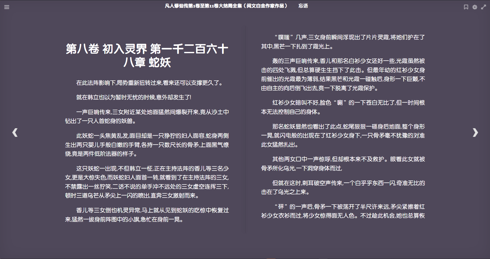

# calibre-web epub阅读界面黑暗模式Tampermonkey脚本

给calibre-web增加黑暗模式, 修改背景色, 修改所有UI菜单的黑暗模式颜色适配


## 使用方法

- 安装[油猴插件](https://chrome.google.com/webstore/detail/tampermonkey/dhdgffkkebhmkfjojejmpbldmpobfkfo)

- 在管理界面新增用户脚本

- 拷贝[calibre-web-epubreader.user.js](./calibre-web-epubreader.user.js)的内容

- 修改`// @match        https://calibre.linkzz.hm/*/*`部分替换为你自部署的url即可

## 自定义

修改代码中这三个变量即可

```JavaScript
/**
 * 字体和图标颜色
 */
const fontColor = "#fff";
/**
 * 背景色
 */
const backgroundColor = "#4f485a";
/**
 * 字体大小
 */
const fontSize = "1.2rem";
```
